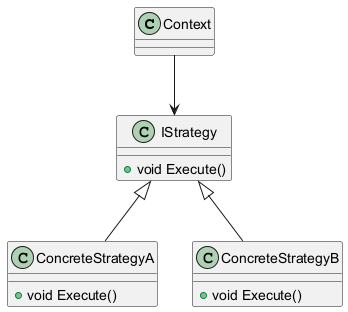
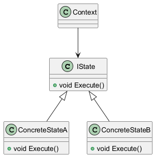

:diagram-use-plantuml:
:author: Залипаева Эвелина КЭ-201
:icon: front
:secttrue: true
:toc: left
:toclevels: 2
:secttruelevels: 2
:sectnums: |,all|
:stylesheet: custom.css
:stylesdir: ./styles
:imagesdir: pic
:toc:
:toc-title: Оглавление
:figure-caption: Рисунок
:table-caption: Таблица

include::test.adoc[]

== Введение в FreeRTOS
FreeRTOS — операционная система реального времени, предоставляющая инструменты для:

* Создания и управления задачами.
* Синхронизации и коммуникации между задачами.
* Работы с таймерами и прерываниями.

== Работа с задачами

=== Создание задач
Используется RtosWrapper (обертка для конкретной RTOS) должен вызывать приватный метод Run для старта потока. Пример:
[source,c]
----
friend class RtosWrapper;    

  private:
    //cstat !MISRAC++2008-7-1-2 To prevent reinterpret_cast in the CreateTask
    __forceinline static void Run(void *pContext)
    {
      static_cast<IThread*>(pContext)->Run();
    }
----

=== Управление задержками
В реализации RtosWrapper::wHandleSysTickInterrupt может вестись подсчёт тиков, что позволяет реализовать:

* Функции задержки (vTaskDelay в FreeRTOS).

* Учёт времени выполнения потоков.

* Таймеры ОС
----
__forceinline static void HandleSysTickInterrupt() {
  RtosWrapper::wHandleSysTickInterrupt();
}
----

== Межзадачная коммуникация

=== Очереди
Очереди — базовый механизм для передачи данных и синхронизации.  

=== Нотификации задач
Нотификации — легковесная альтернатива очередям. Используется функция `taskNotify`.

==== Параметры `taskNotify`:
[cols="1,3", options="header"]
|===
| Параметр | Описание
| `taskToNotify` | Дескриптор задачи-получателя
| `value` | Передаваемое значение 
| `eAction` | Действие над значением получателя
|===

==== Типы действий (`eAction`):
* `eNoAction`: Значение игнорируется (используется для пробуждения задачи).
* `eSetBits`: Установка битов в переменной-уведомлении получателя.
* `eSetValueWithOverwrite`: Перезапись текущего значения.
* `eSetValueWithoutOverwrite`: Запись только если предыдущее значение обработано.

== Сравнение механизмов
[cols="1,1,1", options="header"]
|===
| Механизм | Преимущества | Недостатки
| *Очереди* | Поддержка сложных данных | Высокие накладные расходы
| *Нотификации* | Быстродействие | Ограничение 32 битами
| *События* | Гибкость | Требуют ручного управления битами
|===
== Шаблон проектирования
Это готовый и стандартизированный способ организации бизнес-логики.Использование шаблонов проектирования улучшает читабельность и понимание кода.
* Стратегия
Данный шаблон подразумевает создание интерфейса с общей логикой, на базе которого будут созданы конкретные объекты с конкретной бизнес-логикой.

* Состояние 
Позволяет объекту менять своё поведение в зависимости от внутреннего состояния.

==  Программа предназначена для управления светодиодами в различных режимах работы. Количество режимов `N` и количество светодиодов в каждом режиме `M` не фиксированы — их можно настраивать. При этом цель архитектуры — позволить добавлять новые режимы и светодиоды **без необходимости изменять существующий код**.

=== Постановка задачи

* Необходимо управлять несколькими режимами работы светодиодов.
* Каждый режим может задействовать любое количество светодиодов.
* Светодиоды могут быть подключены к разным портам.
* Переключение режимов выполняется по нажатию кнопки.
* Архитектура должна обеспечивать лёгкость расширения без модификации основной логики.

=== Используемая архитектура

Для решения задачи разработана модульная архитектура, основанная на интерфейсах и шаблонах проектирования.

image::/ModeArchitecture.png[align="center",title="Общая архитектура режимов и задач"

* Интерфейс `IMode` содержит единственный метод `Execute()` — точка входа для выполнения режима.
* Интерфейсы `IToggable` и `ISwitcher` реализуют действия со светодиодами:

  - `IToggable` — для переключения состояния (вкл/выкл),
  - `ISwitcher` — для прямого управления включением и выключением.

Режимы реализуются в виде отдельных классов, наследующих `IMode`. Управление режимами выполняется через `ModeManager`, который по нажатию кнопки переключает активный режим. Конфигурация светодиодов и режимов задаётся в отдельном файле `appconfig.h`, что позволяет добавлять светодиоды **без изменения кода**.

=== Используемые шаблоны проектирования

В проекте применяются два шаблона:

* **Стратегия (Strategy)** — для выбора конкретного режима выполнения (`IMode` и его реализации).
* **Состояние (State)** — для реализации переходов между режимами с сохранением поведения.

Оба шаблона схожи по структуре, и в проекте используется именно `Strategy`, так как режимы независимы и не содержат внутреннего состояния, влияющего на логику перехода.

=== Расширение с использованием ОСРВ

Для повышения модульности и возможности одновременного выполнения нескольких задач, была добавлена операционная система реального времени (RTOS).

Программа теперь состоит из трёх **независимых задач**:

1. **Задача опроса кнопки** — отслеживает нажатие и сообщает об этом.
2. **Задача управления режимом светодиодов** — вызывает `Execute()` текущего режима.
3. **Задача измерения температуры** — отвечает за сбор и фильтрацию данных с датчика.

Благодаря RTOS, эти задачи работают параллельно и не зависят друг от друга. Все настройки светодиодов по-прежнему хранятся в `appconfig.h`.

[NOTE]
====
Например, у разных пользователей платы может быть разное количество светодиодов — достаточно изменить конфигурацию в одном месте, без затрагивания кода.
====

== Выводы
* Освоено создание задач через RtosWrapper и управление их выполнением.
* Изучены нотификации как эффективный механизм для передачи флагов и значений.
* Сравнены механизмы коммуникации: очереди подходят для данных, нотификации — для легковесных событий.
